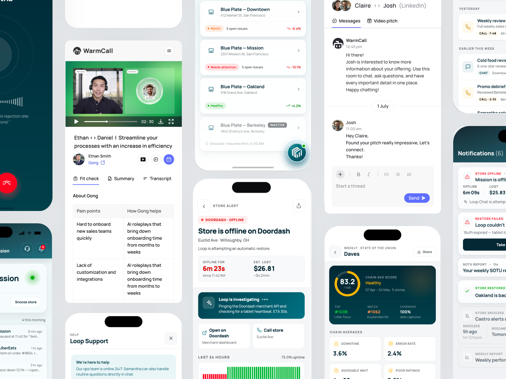
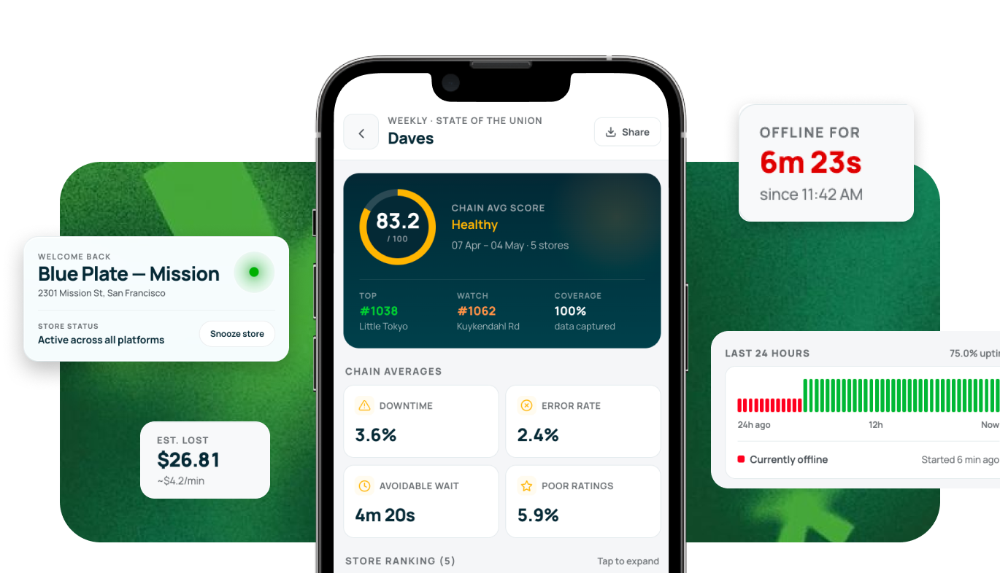
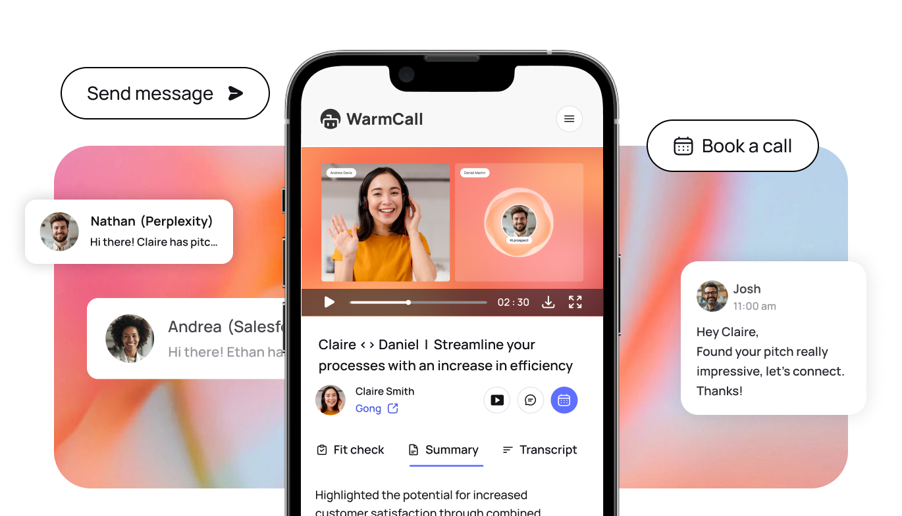

# Designing for the moments that move

Mobile wasn't a smaller version of desktop. It was designed for the moments where being on a phone changed the experience.

**Loop AI × WarmCall**

## What actually belongs on mobile?

I start with why someone would reach for their phone in the first place.

Across both products, that led to very different answers.

**Loop → Urgency**
Notice → Understand → Act

**WarmCall → Accessibility**
Watch → Interact → Respond

## Loop — Operations don't wait for a desktop

Loop helps restaurant operators understand performance and act on their data.

Deep analysis belonged on desktop. But high-priority alerts, live operational status and quick AI interactions needed to reach operators wherever they were.

### Designed for quick intervention

Instead of bringing the entire Loop product to mobile, I focused on the moments where time mattered most: **know what happened, understand why, and decide whether to act.**

[Explore the full Loop mobile app interactions →](https://maitreyi0002-beep.github.io/warmcall-prototype/loop/app.html)

## WarmCall — The pitch could be opened anywhere

WarmCall let sales reps create personalized AI video pitches for prospects. Creating them required focus — personalization, recording and reviewing all lived primarily on desktop ([try the web prototype ↗](https://maitreyi0002-beep.github.io/warmcall-prototype/web/)).

### But consuming them was a different story.

Once a pitch was sent, a prospect could open it from an email, message or their phone.

So the mobile experience was designed around **limited attention and immediate interaction** — watch the pitch, understand its context and respond without needing another device.

[Try the mobile prototype ↗](https://maitreyi0002-beep.github.io/warmcall-prototype/mobile/)

## Same screen. Different reason to exist.

**LOOP**
Mobile because information was **time-sensitive.**

**WARMCALL**
Mobile because the experience was **context-sensitive.**

The principle I carry forward:

**Don't shrink the desktop product.**
**Find the moment that deserves to be mobile.**
